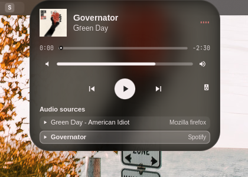

# Omarchy Media Player

A compact music player for the Omarchy Quattro shell. It occupies a slot in the top bar, so workspace and other bar widgets can change width without overlapping it. It opens over the bar when clicked.



## Features

- Cover art, title, artist, and a small visualizer in the compact player.
- Seekable progress, previous/play/next, and per-player MPRIS volume in the expanded player.
- Source selection when multiple media apps have tracks, and an audio output picker.
- Theme-matched compact appearance and a blurred cover-art background when expanded.
- Paused tracks remain visible. The player disappears when no media app has a track loaded.
- The player hides while a window is fullscreen on its monitor or the bar is hidden.

## Install

```bash
omarchy plugin add https://github.com/WhoIsCalebBrown/omarchy-media-player --enable
```

Click to expand or collapse, middle-click to play or pause, and scroll to change system output volume. The expanded slider adjusts the selected media app's own volume, where supported. The speaker icon opens audio output selection.

## Configure

The player is a `bar-widget`. Place it in `bar.layout.left` after the workspaces widget. Its entry accepts these optional keys:

| Key | Default | Purpose |
| --- | --- | --- |
| `monitor` | `"primary"` | Monitor name, or `"focused"` |
| `topMargin` | `0` | Vertical offset from the bar |
| `scale` | `1` | Player scale, from `0.6` to `2` |
| `expandOnHover` | `false` | Open after a short hover |
| `background` | `"theme"` | `"theme"` or `"black"` |
| `visualizerColor` | `"accent"` | `"accent"` or `"artwork"` |
| `textFont` | `"theme"` | `"theme"` or an installed font family |

For example, place the player after workspace indicators on `DP-3`:

```json
{
  "id": "whoiscalebbrown.media-player",
  "monitor": "DP-3",
  "scale": 0.8
}
```

## Remove

```bash
omarchy plugin remove whoiscalebbrown.media-player
```

The plugin does not replace the notification or OSD services and does not edit Hyprland bindings. It depends on the MPRIS and PipeWire services provided by Omarchy's Quickshell installation; there are no additional packages to install.

## Credits

This player is adapted from [Arjun010011's Dynamic Island](https://github.com/Arjun010011/omarchy-dynamic-island), distributed under the MIT license. The original project supplied the player design and many of the QML view components. This repository removes its non-media features and contains subsequent media and appearance changes.
